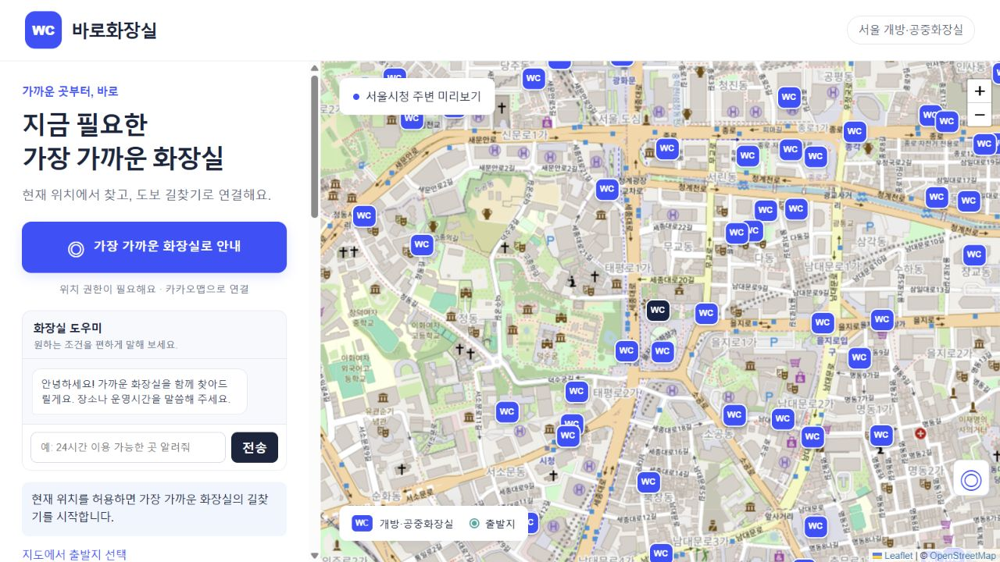

# Skibidi Toilet · 바로화장실

서울시 개방·공중화장실 4,447곳을 지도에 표시하고, 현재 위치에서 가까운 화장실의 도보 길찾기를 연결하는 풀스택 웹사이트입니다.

## 배포 주소

**[바로화장실 이용하기](https://skibiditoilet-pied.vercel.app/)**

서울에서 급하게 화장실이 필요한 사람을 위해, 가까운 시설의 위치와 개방시간을 확인하고 길찾기까지 연결합니다.

## 주요 기능

1. **서울 공중화장실 지도**: 4,447곳의 위치를 지도에 표시하고 시설 이름, 주소, 개방시간을 확인합니다.
2. **가까운 화장실 추천**: 현재 위치를 기준으로 직선거리가 가까운 화장실 6곳을 조회합니다.
3. **출발지 직접 선택**: 위치 권한을 사용하지 않아도 지도에서 출발지를 선택할 수 있습니다.
4. **도보 길찾기 연결**: 선택한 화장실까지 카카오맵 도보 길찾기로 연결합니다.
5. **AI 화장실 도우미**: Groq API로 대화를 이해하고, 등록된 24시간 운영 정보나 장소·주소·시설명 조건으로 화장실을 찾습니다.

## 실행 화면



배포 사이트의 서울시청 주변 미리보기 화면입니다. 실제 현재 위치를 제공하지 않아도 살펴볼 수 있습니다.

## 사용 기술

- 프런트엔드: HTML, CSS, JavaScript, Leaflet, OpenStreetMap
- 백엔드: Vercel Functions
- 데이터베이스: Supabase PostgreSQL 및 REST API
- AI: Groq API를 사용하는 서버 기반 대화형 화장실 도우미
- 배포: Vercel + GitHub

화장실 도우미는 “24시간 이용 가능한 곳 알려줘” 같은 요청과 이어지는 질문을 대화 형식으로 처리합니다. 위치와 대화에서 확인된 조건은 Vercel 백엔드가 받아 Supabase 데이터로 최근접 화장실을 계산합니다. 사용자 위치는 저장하지 않습니다.

## VS Code에서 실행

Node.js 22 이상이 필요합니다. `skibidi_toilet.code-workspace`를 열고 **F5 → 화장실 사이트 전체 실행**을 선택하거나 터미널에서 `npm start`를 실행한 다음 `http://127.0.0.1:4173`을 여세요.

로컬 기본값은 포함된 공공데이터 스냅샷을 사용합니다. 대화 기능과 Supabase 연결까지 확인하려면 `.env.example`을 참고해 `.env.local`을 만들고 값을 입력하세요. 비밀 키 파일은 GitHub에 올라가지 않습니다.

## 구조

```text
public/       화면, 지도, 위치 및 길찾기 UI
api/          Vercel 서버리스 함수 진입점
server/       데이터 조회, 최근접 계산, 대화 처리 로직
data/         로컬 개발용 서울시 데이터 스냅샷
supabase/     테이블 및 보안 정책 SQL
scripts/      배포 전 검증
tests/        API 및 거리 계산 테스트
.vscode/      VS Code F5 실행 설정
web_example/  기존 실습 자료 보존본(로컬 전용)
```

## API

| 요청 | 역할 |
|---|---|
| `GET /api/health` | 서버 상태와 데이터 건수 |
| `GET /api/toilets` | 지도에 표시할 화장실 목록 |
| `POST /api/nearest` | 위도·경도로 가까운 6곳 계산 |
| `POST /api/chat` | 최근 대화를 이해하고 조건에 맞는 가까운 6곳 추천 |
| `POST /api/search` | 기존 단일 자연어 검색 요청 호환 |

## Vercel 환경 변수

```text
DATA_SOURCE=supabase
SUPABASE_URL=https://프로젝트-id.supabase.co
SUPABASE_PUBLISHABLE_KEY=sb_publishable_...
GROQ_API_KEY=gsk_...
GROQ_MODEL=openai/gpt-oss-20b
```

Supabase의 secret/service-role 키는 웹 브라우저나 GitHub에 넣지 않습니다. 읽기 전용 RLS 정책이 적용된 publishable key만 Vercel 서버에 설정합니다.

## 데이터 출처

서울특별시 [서울시 공중화장실 위치정보 OA-22586](https://data.seoul.go.kr/dataList/OA-22586/S/1/datasetView.do), 2026-09-14 수집, 공공누리 제1유형. 시설 명칭·주소·좌표·유형·개방시간을 가공한 정적 스냅샷이므로 실제 운영시간과 출입 조건은 현장에서 확인해야 합니다.

## 검증

`npm test`는 4,447곳의 ID·좌표, 기준 거리, 최근접 정렬, 잘못된 입력 거부, 서울 밖 서비스 범위, AI 조건 필터를 확인합니다. `npm run build`는 Vercel 배포에 필요한 파일을 검사합니다.
